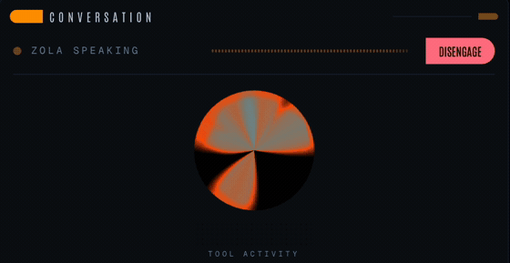
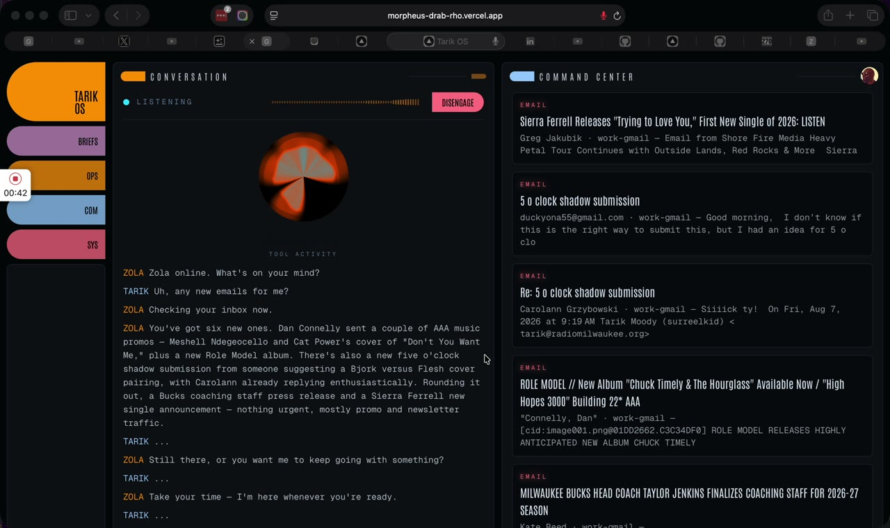
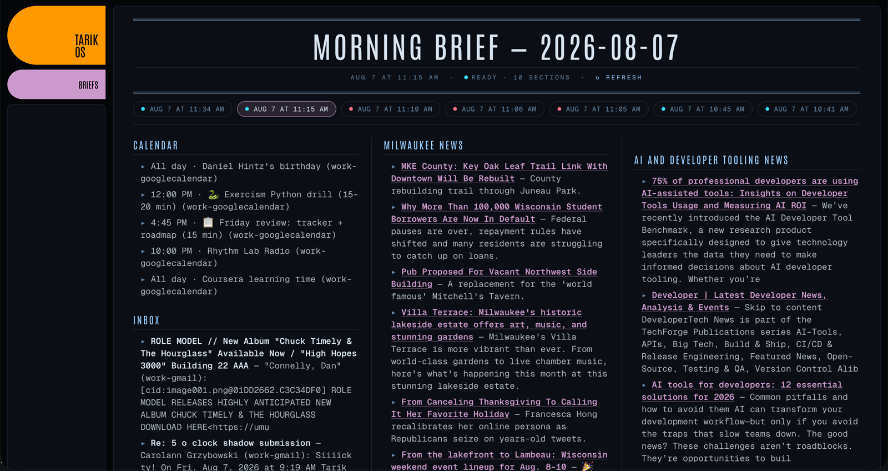
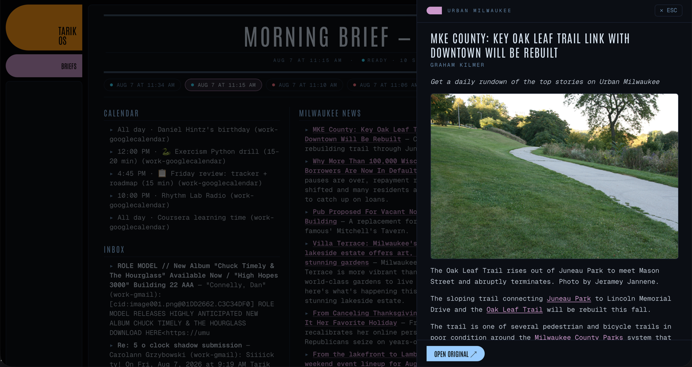

# Tarik OS

A personal AI operating system you talk to. Zola, the voice assistant at its center, reads your mail, works your calendar, runs research, keeps a journal, writes with you, tracks your projects, and briefs you every morning. You speak; she acts; a live dashboard shows what happened. Talk to her in the browser, text her on Telegram, or **call her on a real phone number**. Same brain, same tools, no app.

This is a single-user system built for one person's real life, published as a working reference. Fork it and make it yours. It is not a hosted product and has no multi-tenant support.

## See it working

Asking Zola about the inbox, out loud. The status line tracks the turn (`LISTENING` while you talk, `ZOLA SPEAKING` while she answers) and the orb reacts to her voice.



**▶︎ [Watch the full 70-second exchange, with sound](docs/assets/voice-console.mp4)**. Asked "any new emails for me?", she reads back six, summarized by what actually matters: two AAA music promos, a submission someone already replied to, a press release. The transcript fills in on the left while the cards she pushed appear on the right.

<a href="docs/assets/voice-console.mp4"></a>

### The morning brief

Built while you sleep by a Convex cron. Calendar, inbox, and each feed group in its own column; the pills above are earlier editions of the same day.



Clicking any headline slides in the reader: the article extracted server-side and re-set in the dashboard's own type, with `OPEN ORIGINAL ↗` always available for pages that resist extraction.



## How it works, in plain English

1. **You talk.** The browser opens a realtime voice session with an [ElevenLabs Agent](https://elevenlabs.io/agents), or you dial a Telnyx number that routes to the same agent over a SIP trunk. Either way Zola listens, responds with a voice, and decides when a request needs a real action.
2. **She calls a tool.** Every capability ("what's on my calendar", "draft a reply to that email", "run my research workflow") is a webhook the agent calls: `POST /api/tools/<tool_name>` on this app, authenticated with a shared secret. The route does the actual work and returns a sentence for Zola to speak.
3. **The work happens server-side.** Tool routes talk to Gmail and Google Calendar through [Composio](https://composio.dev) (which holds the OAuth tokens), to Claude for writing and reasoning, and to [Convex](https://convex.dev) for state.
4. **The dashboard reacts live.** Convex is a realtime database: when a tool writes a briefing card, a journal entry, or a workflow result, every open page updates instantly, with no refresh. The UI is a set of LCARS-styled panels: morning brief, mail center, calendar, telos (goals), journal, memory.
5. **Some things run on a clock.** Convex cron jobs run scheduled workflows: a nightly pass that consolidates the day's conversations into long-term memory, a 3am pass that mines journal entries for goal signals, a morning brief, and a Sunday weekly review.
6. **She remembers.** Conversations are stored in Convex, embedded with [Voyage AI](https://www.voyageai.com), and recalled semantically, so "what did I say about that station project last week?" works.

Seven guardrails are structural, not polite requests:

- **Zola can draft email; only a human can send it.** The send endpoint exists solely behind the browser UI's Send button. The agent's tool surface has no send path, and a test fails the suite if one ever appears.
- **Calendar writes confirm before they commit.** Event creation and edits go through a confirm ritual in conversation.
- **The browser agent never types a password, and browsing is always attended.** Zola can drive a real browser (see Viewport below). Sessions are signed out by default; a login wall stops the agent and hands you the wheel. If you set up a persistent [Browserbase Context](#logged-in-browsing-optional) and sign in by hand, a session can carry those logins, but only when you ask for them in that request, never by the agent's own initiative. No scheduled job can start a browser session at all. All three parts are enforced by tests.
- **Inferred evidence can only ever suggest, never record.** A calendar block can propose that a habit happened; only you accept it. The mutation that writes a vote requires a signed-in human and has no shared-secret path, so nothing automated can mark a day done on your behalf, and a test fails the suite if a secret branch is ever added to it.
- **Zola can phone exactly one number, and it isn't a parameter.** The `call_tarik` tool takes no destination at all. The number comes from `OWNER_PHONE` on the server, so there is no argument to pass and nothing to talk her into. A test scans the route, the published tool schema, and the count of dialling sites; all three were watched to fail before being trusted.
- **She proposes edits to your writing; she never applies them.** Voice can't show you a diff, so voice doesn't write. `propose_studio_edit` stores a pending rewrite that appears in the open document while she is still talking; you take it or leave it on screen. Accepting refuses outright if that paragraph changed underneath the proposal, because applying anyway would silently delete the rewrite you did by hand.
- **She cannot delete anything in your project tracker.** Not blocked, absent: there is no delete or archive function in the Plane client at all, so a mis-heard sentence has nothing to reach. A test asserts they stay absent.

## Tech stack

| Layer | Technology |
|---|---|
| Web app | Next.js 16 (App Router, Turbopack), React 19, Tailwind CSS 4 |
| Voice | ElevenLabs Agents (realtime speech-to-speech), `@elevenlabs/react` |
| Telephony | Telnyx (number + SIP trunk) → ElevenLabs, so the same agent answers a real phone |
| Reasoning / writing | Claude (Anthropic SDK, server-side) |
| State + realtime + crons | Convex |
| Auth | Clerk (protects every page and API route except the secret-gated tool webhooks) |
| Google access | Composio (holds Gmail + Calendar OAuth, multi-account) |
| Semantic memory | Voyage AI embeddings + Convex vector search |
| Projects and tasks | Plane Cloud (REST API; read live, no mirror) |
| Rich text | Plate (Studio documents) · TipTap (mail compose) |
| File storage and sharing | Cloudflare R2 with presigned, expiring, revocable links |
| Text channel | Telegram bot (same tool surface, narrower) |
| Browser automation | Browserbase (hosted sessions, interactive live view) + Stagehand (AI agent loop) |
| Email safety | linkedom server-side sanitizer + sandboxed iframes |
| 3D / HUD flourishes | three.js via react-three-fiber |
| Tracing | OpenTelemetry (`@vercel/otel`) → self-hosted [Arize Phoenix](https://phoenix.arize.com), with OpenInference semantic conventions |
| Hosting | Vercel (app) + Convex Cloud (backend) |

## Architecture

```
                ┌─────────────────────────────┐
   voice        │  ElevenLabs Agent (Zola)    │
  ┌────────┐    │  listens · speaks · decides │
  │ Tarik  │◄──►└──────────────┬──────────────┘
  └───┬────┘         ▲         │ webhook + shared secret
      │ phone   SIP  │         │
      │  └───────────┘         │
      │   Telnyx number        │
      │ browser                ▼
      │         ┌─────────────────────────────┐
      └────────►│  Next.js app (Vercel)       │
                │  /api/tools/<tool>  ← agent │
                │  /api/mail, /api/reader …   │
                │  pages: brief · mail · telos│
                └───────┬──────────┬──────────┘
                        │          │
              Composio  │          │  Convex (realtime DB,
              (Gmail,   │          │  workflows, crons,
              Calendar) │          │  vector memory)
                        ▼          ▼
                   Google APIs   Claude · Voyage
                                 Plane (projects, read live)
                                 Cloudflare R2 (saved files, share links)
                                 Browserbase + Stagehand (Viewport browser)
```

Every tool call is wrapped in an OpenTelemetry span, and after a call ends ElevenLabs POSTs the full transcript to `/api/elevenlabs/post-call`, which maps it into a conversation trace: the utterance, the tool she picked, and what came back, in one tree. Both paths ship to a self-hosted Phoenix. Tracing is never load-bearing: the webhook answers as soon as the signature verifies and ships afterwards, so a dead collector cannot break the thing it observes.

The repeatable pattern, documented in [AGENTS.md](AGENTS.md): every new capability is (1) a `case` in `src/app/api/tools/[tool]/route.ts`, (2) a tool definition in `scripts/provision-agent.ts`, (3) nothing else. Tools self-register in Convex on first use and appear in the dashboard control panel with health status and an enable/disable toggle.

## Project structure

```
src/app/            Pages: home HUD, /briefs, /mail, /studio, /projects, /contacts,
                    /documents, /telos, /habits, /brain, /control
src/app/api/tools/  The agent's tool webhook (one case per capability)
src/app/api/mail/   Browser-facing mail routes (Clerk-protected)
src/app/api/elevenlabs/  Post-call webhook → conversation traces
src/lib/            Server-side domain logic: google.ts, mail.ts, calendarLib.ts,
                    plane.ts + planeLib.ts (API boundary / pure logic) …
convex/             Schema (26 tables), workflows, crons, memory consolidation,
                    telos, habits, studio documents, contacts
scripts/            provision-agent.ts · connect-google.ts · import-telos.ts
tests/              node --test unit tests for the pure logic
evals/              Tool-selection replay harness + Phoenix dataset/experiment push
docs/superpowers/   Design specs for each build phase
```

## Running it yourself

You are standing up your own instance wired to your own accounts. Nothing here talks to the author's data.

### Prerequisites

- Node.js 22+ and npm
- Accounts: [Convex](https://convex.dev), [Clerk](https://clerk.com), [ElevenLabs](https://elevenlabs.io) (Agents access), [Composio](https://composio.dev), [Anthropic](https://console.anthropic.com), [Voyage AI](https://voyageai.com) (optional, semantic memory), [Browserbase](https://browserbase.com) (optional, Viewport)

### Setup

```bash
git clone https://github.com/tmoody1973/TarikOS.git
cd TarikOS
npm install

# Convex: creates your deployment and writes CONVEX_* vars
npx convex dev

# Fill in the rest of .env.local (see table below)

# Connect a Google account through Composio (repeat per account)
node scripts/connect-google.ts work

# Create/update the ElevenLabs agent with the full tool surface
node scripts/provision-agent.ts

npm run dev
```

Sign in through Clerk, open the site, and start the voice session from the dock.

### Environment variables

Values live in `.env.local` (gitignored) and in Vercel/Convex env settings in production. Never commit them.

| Variable | What it is |
|---|---|
| `ANTHROPIC_API_KEY` | Claude API key (drafting, workflows, consolidation) |
| `ELEVENLABS_API_KEY` | ElevenLabs API key |
| `ELEVENLABS_AGENT_ID` | The provisioned agent's id (written by provision script) |
| `COMPOSIO_API_KEY` | Composio key holding your Google OAuth connections |
| `MORPHEUS_TOOL_SECRET` | Shared secret the agent sends with every tool webhook |
| `NEXT_PUBLIC_CLERK_PUBLISHABLE_KEY` / `CLERK_SECRET_KEY` | Clerk auth |
| `OWNER_EMAIL` | Your verified Clerk email. One instance serves one person: any other signed-in account gets a wall instead of the dashboard. Leave unset and that second lock is off. |
| `NEXT_PUBLIC_CONVEX_URL` / `NEXT_PUBLIC_CONVEX_SITE_URL` / `CONVEX_DEPLOYMENT` | Convex deployment |
| `VOYAGE_API_KEY` | Voyage embeddings for semantic memory (optional) |
| `AGENTKEY_API_KEY` | Reserved for external agent access |
| `BROWSERBASE_API_KEY` / `BROWSERBASE_PROJECT_ID` | Browserbase (Viewport browser sessions; optional) |
| `FIRECRAWL_API_KEY` | Reader fallback for pages that block server-side fetches (optional). Unset simply means those pages show "open the original" instead. |
| `TOOL_BASE_URL` | Your deployment's tool webhook base, e.g. `https://<your-app>/api/tools` |
| `OWNER_PHONE` | The only number `call_tarik` can dial, in E.164. Unset means the tool answers that calling isn't configured. |
| `ELEVENLABS_PHONE_NUMBER_ID` | The imported SIP-trunk number in ElevenLabs (`phnum_…`), used to place outbound calls |
| `ELEVENLABS_WEBHOOK_SECRET` | HMAC signing secret for the post-call webhook (optional; without it the route rejects every delivery and you simply get no conversation traces) |
| `OTEL_EXPORTER_OTLP_ENDPOINT` / `OTEL_EXPORTER_OTLP_HEADERS` | Where traces go, e.g. a self-hosted Phoenix. Headers take the form `Authorization=Bearer <key>`. Both optional. Unset means no tracing, and nothing else changes. |
| `PLANE_API_TOKEN` | A Plane workspace access token, for `/projects` and the task tools. The workspace slug is a constant in `src/lib/planeLib.ts`; change it to yours. Optional. Unset means the board says so instead of showing an empty one. |
| `R2_ACCESS_KEY` / `R2_SECRET_ACCESS_KEY` / `R2_STORAGE_TOKEN` | Cloudflare R2, for saved documents and share links (optional) |
| `SHARE_BASE_URL` | Where a share link points, e.g. `https://<your-app>` |
| `TELEGRAM_BOT_TOKEN` | Telegram bot token for the text channel (optional) |
| `GOOGLE_CONTACTS_ACCOUNT_ID` | Which connected Google account the contacts sync reads and writes |
| `CONVEX_DEPLOY_KEY` | Set in Vercel only, never locally. Lets the production build deploy the Convex schema before building the app, so a push ships both together. |

`MORPHEUS_TOOL_SECRET` must be set in both the Convex deployment (`npx convex env set`) and the app env, and is baked into the agent by the provision script.

### Logged-in browsing (optional)

By default every browser session is signed out, and that is the safe setting.
If you want Zola to reach pages behind your own logins:

```bash
node --experimental-strip-types scripts/create-browser-context.ts
# put the printed id in BROWSERBASE_CONTEXT_ID (local + Vercel)
```

Then click **VIEW** in the rail and sign in to the sites you want remembered.
Browserbase encrypts context data at rest. After that, "check my orders on X"
works, but only when you say so out loud; the agent never opts in by itself.

**Only sign into things you would not mind an agent reaching.** A context is
one browser profile, so everything in it is reachable by any session that opts
in, and a hostile page can try to steer an agent that is holding live cookies.
No code can enforce what you choose to log into. Keep email, banking, and
anything holding a card out of it.

### Locking your instance to you

The landing page at `/` is public, so `/sign-in` is reachable by anyone. Two
locks, and you want both:

1. **Stop new sign-ups at Clerk.** Dashboard → **Restrictions**: turn on
   *Restricted* mode (invitation-only, free), or on a paid plan use the
   *Allowlist* with just your address. Do this per instance. A development
   instance and a production instance have separate settings.
2. **Set `OWNER_EMAIL`.** Anyone holding a valid session that isn't yours gets
   a "this instance serves one person" wall pointing at the repo. This is what
   catches an account that already existed before you locked sign-ups.

### Tests and deploys

```bash
npm test              # node --test, 793 pure-logic and guardrail tests
npm run build         # production build (Turbopack)
```

A push to `main` deploys both halves. `vercel.json` sets the production build
command to `npx convex deploy --cmd 'npm run build'`, so the schema ships first
and the frontend then builds against the deployment it just created. The step is
gated on `VERCEL_ENV`, because `convex deploy` targets whatever deployment its
key belongs to regardless of branch, and a production key on a preview build
would overwrite production's schema. To deploy by hand:

```bash
npx convex deploy         # backend
npx vercel deploy --prod  # app  (plain `vercel --prod` only builds)
```

## Features

- **Morning brief**. A GOALS-led daily brief assembled by workflow: calendar, mail highlights, feeds, telos progress. Regenerates on demand by voice ("run my brief").
- **Mail center** (`/mail`). Read full Gmail threads in-app (server-sanitized, sandboxed), compose and reply with rich text, Gmail-native drafts, explicit send. Multi-account. Say *"draft a reply to the X email saying…"* and Zola writes it with thread context, and it lands as a badged draft you edit and send yourself.
- **Studio** (`/studio`). A real writing workspace, not a note field. Five document types (note, draft, brief, plan, decision record), each starting from its own template; Plate's full editor with tables, lists, media and DOCX export; version snapshots you can restore; and references that point a document at the brief, conversation, contact or other document it came from. Say *"start a plan for the pledge drive"* and it exists, shaped like a plan. Ask her to tighten a paragraph and she quotes it back to find it, then leaves a suggestion waiting on screen for you to take or leave. Studio documents are searchable from the brief, from recall, and by meaning.
- **Projects** (`/projects`). A board backed by [Plane](https://plane.so), so you never open Plane. Say *"add calling the bank to my list"* and it's a task; say *"start a project for the pledge drive with these five tasks"* and she reads the plan back before creating anything. The board reads Plane live and keeps no copy of it, because a copy is a thing that can disagree. Click a card to read it, move it, or reprioritise it.
- **Contacts** (`/contacts`). Your Google contacts, synced nightly and searchable by name, number or email. Zola can add, update and delete them, writing straight through to Google so nothing can drift. She resolves to exactly one person or asks; two matches is a question, never a guess. An edit reports what it displaced, because Google replaces a whole field at a time and that is the last moment the old value exists.
- **Documents** (`/documents`). Turn a brief, a research result, or a Studio document into a real file, then hand it to someone. Share links are minted per visit from R2, with an expiry, a download cap, and revocation. Sharing takes a spoken confirmation; saving a file for yourself does not, because it never leaves your own login.
- **Telegram**. The same assistant over text, with a deliberately narrower tool surface. Anything whose safety rests on a spoken confirmation stays on voice; the exclusions and their reasons are listed in `src/lib/textTools.ts`.
- **Viewport**. A slide-in panel showing a real hosted browser that Zola drives by voice ("go dig into X") while you watch; click into the frame to take over, or open a blank session and browse yourself. Findings become a brief with a session-replay link.
- **Feed manager**. Add news sources by voice ("add The Verge to tech headlines") or by pasting a URL in the Control Panel; feeds are autodiscovered and validated before saving, with per-feed health dots.
- **Calendar by voice**. List, create, and move events with a confirm-before-write ritual.
- **Telos** (`/telos`). The life-context layer that makes everything else goal-aware. Full write-up in [The telos layer](#the-telos-layer) below.
- **Habits** (`/habits`). Identity-based pillars rather than a checklist. Each habit is a vote for the kind of person you're becoming, logged by voice or on the page, and completion is graded (minimum, standard, beyond, intentionally skipped) because "I did the two-minute version" and "I did the full thing" are different truths a checkbox can't tell apart. **There is no streak anywhere in the system.** The number on display is how often you came back after a gap, since coming back is the skill a streak counter punishes you for losing. An intentional skip is a decision, not a lapse, and carries no penalty. An evening cron composes a check-in card that waits on the dashboard. It has no push channel, so it cannot nag, by construction. The Sunday review names the pillar with the most friction and asks you to change exactly one variable, because changing several makes it impossible to tell which one helped.
- **Observability**. Every tool call emits a span with its real outcome (`success`, `no_match`, `ambiguous`, `disabled`, `error`), which is deliberately separate from the `ok` flag Zola speaks from: several tools answer *"no timed event matching that"* as a helpful sentence rather than an error, and counting those as successes would quietly corrupt any measurement built on the data. After each call the full conversation arrives as a trace with tool calls attached to the turn that produced them.
- **Voice journaling**. Journal entries by voice; a nightly pass mines them for goal signals.
- **Semantic memory**. Conversations consolidated nightly and recalled by meaning, not keywords.
- **Research workflows**. Scheduled or on-demand multi-step research (RSS + web search) rendered as briefing cards with an in-app reader.
- **Control panel** (`/control`). Every tool's health, last error, and an enable/disable toggle; disabled tools are blocked at the route.
- **Phone**. Call a real number and Zola answers with the same brain and the same tools; no app, no browser, no session to start. She can call you too, for the things a dashboard card can't reach you for. Telnyx owns the number and the SIP trunk, ElevenLabs stays the runtime, and the whole inbound path took no application code. The only code is the outbound tool and its guardrails.
- **Voice console**. Mic waveform, live transcripts, and a tool-activity matrix so you can see Zola working.
- **Tool-selection evals** (`evals/`). The loop that turns "I think that description is better" into a number. Real past utterances become a labelled dataset; the harness replays them against the live tool definitions and scores which tool the model reaches for. Runs locally in seconds, or as a Phoenix experiment when a run is worth keeping. Two identical runs disagree on ~9% of utterances, so the harness reports that noise floor rather than letting you read meaning into a two-point move.

## The telos layer

The idea comes from [Daniel Miessler's TELOS framework](https://github.com/danielmiessler/Telos) (part of his [PAI](https://github.com/danielmiessler/PAI) / LifeOS thinking): a personal AI is only useful if it knows what you're actually trying to do with your life (your mission, goals, problems, and challenges) in a structured form it can reason over, not scattered across chat history. LifeOS keeps that as markdown files read at session start. Tarik OS ports the concept onto its own stack: what LifeOS does with files, this does with realtime database rows, embeddings, and cron jobs.

How it works here:

- **Structured rows, not a document.** The telos is a `telosItems` table holding mission, goals (each with a *measurable*, the finish line), problems, challenges and strategies, each row carrying status, review timestamps, and provenance. Structured because everything downstream (briefs, drift lines, staleness) queries fields, not prose.
- **Seeded by conversation.** Zola populates it through a voice interview ("what are you actually working toward?") and maintains it by voice through the `get_telos`, `add_telos_item` and `update_telos_item` tools.
- **Standing context.** A summary of your active telos rides into *every* voice session as agent context, so Zola connects day-to-day requests to long-term goals without being asked.
- **It updates itself.** The nightly consolidation pass mines the day's conversations and journal entries for goal-relevant signals and updates telos items *with provenance*, so every change links back to the conversation it came from.
- **It surfaces everywhere.** The morning brief opens with a GOALS section (active goals, a drift line like "this week served G2; nothing touched G0", review nudges); a Sunday cron compiles a weekly review brief that Zola walks you through by voice; the `/telos` page shows every item with staleness dots by review cadence and a provenance panel.
- **Semantic recall spans it.** Telos items are embedded alongside memories and journal entries, so "what did I say about the certification goal?" finds them by meaning.

The loop this closes: you tell your AI what matters once, it holds you to it every morning, and it quietly keeps the record current from how you actually spend your days.

## Design specs

Each phase shipped against a written spec in [`docs/superpowers/specs/`](docs/superpowers/specs/): foundation, workflows and briefs, telos, mail center, viewport, habits, observability and evals, restaurant booking, document storage, mobile PWA, and Plane projects. Decisions that were genuinely contested get their own record in [`docs/decisions/`](docs/decisions/): which editor Studio uses and why, and why Studio keeps its own store rather than becoming a thought. They read as a build log of the decisions and their reasons.

## License

[MIT](LICENSE). Do what you like, attribution appreciated. The name "Tarik OS" refers to the author's personal instance; your fork will have your name on it anyway.
