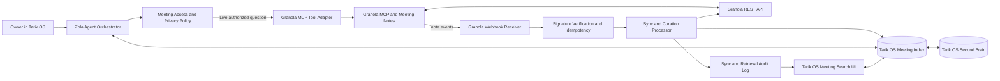

# Tarik OS × Granola: Meeting Search Tool for Zola

> **Product statement.** Zola should be able to find and reason over the meetings the owner is authorized to access, then answer with traceable sources, not vague recollection. Granola remains the meeting-notes source; Tarik OS provides the conversational interface, optional local index, privacy controls, and a curated Second Brain connection.

**Status:** Architecture and product specification  
**Primary use case:** Search authorized Granola meeting notes and transcripts from Zola in Tarik OS  
**Integration surfaces:** Granola MCP for live agent retrieval; Granola REST API and webhooks for durable indexing  
**Default safety posture:** Read-only; raw transcripts remain in Granola unless the owner explicitly enables a narrow indexing or capture policy

---

## 1. What Zola Will Be Able to Do

After the owner authorizes Granola, Zola can answer questions grounded in meetings such as:

> “What did I commit to in my meetings with Sarah last month?”

> “Find the discussion where we decided to use Plane for project management. What were the open risks?”

> “Summarize the last three customer calls about onboarding, and separate repeated feedback from one-off comments.”

> “Which meetings mentioned the Tarik OS Projects module, and what follow-ups are still open?”

The system should respond with a short synthesis and a **source ledger** naming each meeting, date, owner/attendees where available, and a direct note identifier or open-in-Granola link. Zola must clearly distinguish direct meeting evidence from its own synthesis, and it must say when the source set is incomplete because it does not have access to a note, folder, or workspace.

Granola offers both an individual-user MCP connection for conversational AI and a REST API for custom integrations. The MCP is designed for searching meeting notes and transcripts through browser OAuth; the API supports authorized note listing and retrieval with Bearer tokens.[1] [2] Granola notes are private by default, and both approaches respect the key or user’s access scopes.[1] [3]

---

## 2. Integration Options

The integration can begin simple or become a durable Tarik OS capability. The correct choice depends on whether Zola needs **live, user-triggered meeting search only** or a persistent meeting layer with automatic updates and Second Brain relationships.

| Approach | What it provides | Tradeoffs | Ongoing cost | Setup complexity |
|---|---|---|---|---|
| **A. Live meeting-search tool** | Zola uses Granola MCP during a conversation to query authorized meeting notes and transcripts. Results are shown with citations; nothing is stored in Tarik OS beyond a temporary session reference. | Fastest and most private starting point. It does not provide a local meeting timeline, proactive project links, or durable cross-meeting search history. | Uses the owner’s Granola plan and existing Tarik OS hosting. | Low. |
| **B. Connected Meeting Intelligence service** | Zola uses MCP for live queries and Granola API/webhooks to maintain a minimal local index of permitted note metadata, summaries, decisions, action items, and source links. | Requires backend storage, an HTTPS webhook endpoint, key management, idempotency, and clear retention policy. It enables a rich Tarik OS meeting experience and reliable Second Brain linking. | Uses the owner’s Granola plan and Tarik OS hosting; deterministic sync runs without separate agent sessions. | Medium to high. |
| **C. Full meeting knowledge mirror** | Tarik OS stores full transcripts and builds a local semantic index of all authorized meetings for complex historical research. | Highest retrieval flexibility but carries the largest privacy, retention, security, and data-governance burden. It should not be the default. | Increased storage and indexing cost. | High. |

**Decision guidance.** Approach A is the recommended pilot. Approach B is the recommended durable product once the owner approves a written retention policy. Approach C should be enabled only for explicitly selected folders or projects after the benefits clearly justify duplicating sensitive meeting text.

---

## 3. Recommended Architecture



The **Granola MCP Tool Adapter** provides current, user-scoped meeting retrieval inside live Zola conversations. Granola documents a Streamable HTTP MCP endpoint at `https://mcp.granola.ai/mcp`, connected with browser OAuth; it can access notes only within the connected user’s active workspace and granted scopes.[1]

The **Sync and Curation Processor** is optional in the pilot, but it is required for a durable meeting index. It is deterministic backend code—not a free-running agent. It receives Granola webhook events, verifies them, fetches the newest permitted note through the REST API, updates Tarik OS metadata and curated meeting knowledge, and creates only eligible Second Brain relationships. Granola webhooks provide event identifiers and signed deliveries, making this event-driven design preferable to polling.[4]

---

## 4. Zola Tool Contract

Zola should never be given a generic, unconstrained “search all transcripts and do anything” capability. It should receive a narrow, traceable tool contract that separates discovery, retrieval, synthesis, and intentional capture.

| Internal Zola tool | Purpose | Inputs | Output and guardrails |
|---|---|---|---|
| `meeting_search` | Find candidate meetings through Granola MCP or the local permitted index. | Natural-language query, optional date range, people, project, folder, and result limit. | Returns meeting metadata and relevance snippets. No unbounded transcript dump. |
| `meeting_get_context` | Retrieve a selected meeting’s summary, attendees, decision/action-item candidates, and only the transcript segments needed to answer. | Granola note ID, question, detail level. | Returns cited evidence with note ID and segment markers; respects Granola scope at read time. |
| `meeting_answer` | Produce a source-grounded synthesis. | Question plus retrieved evidence set. | Separates **Meeting evidence** from **Zola synthesis**, lists source meetings, and identifies gaps. |
| `meeting_compare` | Compare themes or commitments across a small, explicit set of meetings. | Query, selected note IDs/date range, comparison dimension. | Returns recurring themes, disagreements, and one-off claims with meeting-level provenance. |
| `meeting_capture_candidate` | Propose a durable Second Brain memory from a meeting. | Note ID, candidate summary, type, destination project/topic. | Creates a proposal only; does not persist full transcript text. |
| `meeting_open_source` | Open the canonical Granola note from a Zola answer. | Note ID or source URL. | Provides a direct source path, not a copied transcript. |

### Example conversation

```markdown
Owner: What did I promise the product team after the roadmap meeting?

Zola: I found one strong match: **Product Roadmap — 2026-08-01**.

**Meeting evidence**
- You said you would circulate the revised project-scope proposal by Tuesday.
- You agreed to add a risks section covering integrations and meeting-data privacy.

**Zola synthesis**
Your next concrete follow-up is the scope proposal. The integrations/privacy risks section should be included rather than handled separately.

**Sources**
1. Product Roadmap — 2026-08-01 — Granola note `not_…`

Would you like me to draft this as a Plane work-item proposal, or capture the decision in the Second Brain?
```

The last sentence deliberately **proposes** a downstream action. It does not silently create tasks in Plane or write a meeting-derived memory.

---

## 5. Retrieval and Answer Quality Rules

Every meeting answer needs a reliable provenance model. Zola should use a high-quality, concise answer even when the underlying transcript is long.

| Rule | Required behavior |
|---|---|
| **Evidence before synthesis** | Retrieve the relevant Granola note(s) and identify supporting sections before making a claim. |
| **Source ledger** | Provide title, date, and canonical Granola note link or ID for every meeting used. |
| **Scope transparency** | Say “I searched your connected Granola workspace” rather than implying all meetings were searched. Say when Granola scope, time range, or plan limits may exclude results. |
| **No invented commitments** | If the meeting language is tentative or speaker attribution is unavailable, label the conclusion as a proposal or unresolved point. |
| **Controlled transcript display** | Return the minimum quoted or paraphrased context needed for the answer. Make the canonical Granola note the place for full review. |
| **Separation of sources** | Label meeting facts, Zola analysis, and Second Brain context separately to avoid blending them. |
| **Freshness check** | For questions about the latest decision or action item, retrieve the current source directly from Granola rather than relying solely on a local index. |

Granola’s API returns only notes that have both a generated AI summary and a transcript; incomplete or still-processing notes are not returned by the documented list/get behavior.[2] Zola should state that a meeting may be unavailable if it is still processing rather than treating absence as evidence that no meeting occurred.

---

## 6. Granola Authorization and Privacy Model

Meeting content is significantly more sensitive than a typical project title or task. The integration must make its access model visible and revocable.

| Authorization path | Best use | Scope and privacy implication |
|---|---|---|
| **Granola MCP via browser OAuth** | Live personal meeting search during Zola conversations. | Uses the individual’s active Granola workspace and permitted personal/public note scopes. It is the best pilot path.[1] |
| **Personal Granola API key** | One owner’s durable meeting index. | Can access only the key owner’s permitted personal/public notes, depending on granted scope. It should use the least privileges needed.[3] |
| **Workspace API key** | Shared Tarik OS service serving an approved team workspace. | Can access public notes and spaces explicitly enabled for API access. Use only with a documented team policy and administrator approval.[3] |

### Default privacy settings

| Data category | Default Tarik OS behavior | Owner control |
|---|---|---|
| Meeting metadata | Store only when an owner enables the durable index. | Choose index on/off, folders, date range, and retention period. |
| AI summary | Store as a short, source-linked cache only under Approach B. | Include/exclude selected folders or projects. |
| Raw transcript | **Do not copy to Tarik OS by default.** Retrieve on demand from Granola. | Explicit, folder-level opt-in required for local transcript indexing. |
| Action items and decisions | Show in Zola as candidates; capture only through an owner-approved rule or confirmation. | Choose auto-propose, manual capture, or no capture. |
| Personal/private notes | Search only when the connected Granola identity has access and the owner enabled personal scope. | Personal scope can be removed independently of public/team access. |
| Second Brain memory | Store a concise, attributable summary plus source link—not a full transcript. | Owner can mark a candidate private, project-scoped, or discard it. |

Granola documents personal and public note scopes separately, with private notes available only to a user who already has access and public notes tied to workspace visibility.[1] [3] Tarik OS must not use a broad workspace key merely for convenience when the owner’s personal OAuth connection is sufficient.

---

## 7. Event-Driven Meeting Index

Granola supports webhooks on Business and Enterprise plans. The integration should subscribe to the smallest needed scope and, wherever possible, limit delivery to selected folders.[4]

### Recommended subscriptions

| Event | Tarik OS action | Second Brain action |
|---|---|---|
| `note.generated` | Fetch note metadata/summary and add or update the local index. | Create a candidate only if the note matches an approved project/topic rule. |
| `note.regenerated` | Refresh cached summary and stale retrieval metadata. | Mark any linked summary as updated; do not overwrite a user-edited Second Brain note. |
| `note.edited` | Fetch current note after verification; record that summary content changed. | Present an update candidate if a previously captured decision/action changed materially. |
| `note.access_granted` | Add the now-accessible note to the permitted index if it matches enabled folders/scopes. | No automatic knowledge capture. |

Webhook payloads include an `event_id`, event type, note ID, and timestamp but not the full note content; the integration should fetch the note through the API after verifying the signed event.[4] The receiver must acknowledge valid events quickly, then perform retrieval/indexing asynchronously. It must store each `event_id` before processing side effects so retries do not create duplicates.

---

## 8. Second Brain Capture Rules

The Tarik OS Second Brain is a **curated memory**, not a meeting-transcript warehouse. Its job is to make durable decisions and commitments discoverable across projects—not to retain every spoken word.

| Meeting signal | Second Brain behavior | Required source record |
|---|---|---|
| Explicit decision | Propose a `Decision` memory with context, decision, owner, and source link. | Granola note ID and title/date. |
| Action item personally owned by the user | Propose an `Action Commitment`; optionally send a Plane work-item proposal. | Granola note source plus linked Plane project if chosen. |
| Repeated product/customer theme | Propose an `Insight` memory after the pattern appears in multiple meetings. | At least two Granola sources, each linked. |
| Project status update | Update the Tarik OS project context as a time-bound signal. | One source meeting; expire when newer evidence supersedes it. |
| Personal reflection or sensitive conversation | Do not auto-capture. | Owner must explicitly request capture and set privacy visibility. |
| Routine meeting summary | Keep retrievable in Granola/local index only. | No Second Brain memory. |

Every meeting-derived memory requires provenance fields: `source_system = granola`, `granola_note_id`, `meeting_date`, `captured_by = zola|owner`, `privacy_class`, and `capture_reason`. The UI should show an **origin badge** so the owner knows whether something is a Granola fact, a Zola synthesis, or a personal Tarik OS note.

---

## 9. Tarik OS User Experience

Meeting intelligence should enrich existing modules rather than create an isolated transcript archive.

### 9.1 Zola conversation

When the owner asks a meeting-related question, Zola displays a compact source-aware response card beneath the conversation:

| Element | Behavior |
|---|---|
| **Answer** | A concise evidence-grounded response. |
| **Sources** | Clickable meeting chips with title, date, and Granola origin. |
| **Scope label** | “Searched connected Granola workspace: personal + Team space” or equivalent. |
| **Actions** | `Open meeting`, `Refine search`, `Propose task`, `Capture decision`, and `Keep private`. |
| **Privacy label** | Shows whether result came from personal, shared, or public note access. |

### 9.2 Second Brain meeting lens

The existing **BRAIN** section can add a `MEETINGS` filter rather than requiring a separate product module. It should support date, participant, company/project, folder, and capture-status filters. The default view shows only metadata and summaries; a user clicks `Open in Granola` to review full content.

### 9.3 Project context

Within the **PROJECTS** section, add a `Meeting Evidence` panel that displays only meetings explicitly linked to that project or matched through an approved project rule. It should show recent decisions, commitments, and unresolved questions—not all raw notes.

### 9.4 Search refinements

Zola should ask a focused follow-up when the query is underspecified:

> “I found 14 product meetings. Should I focus on meetings with Sarah, the last 30 days, or notes linked to Tarik OS?”

This protects against over-broad retrieval and improves answer quality.

---

## 10. Integration with the Plane Projects System

Granola should enhance the Plane integration without allowing meeting content to silently create external work.

| Zola finding | Allowed next step | Requires approval? |
|---|---|---|
| A clear owned action item | Draft a Plane work-item proposal in Tarik OS. | Yes, before the Plane write. |
| A project decision | Draft a Plane Page update or link the source meeting to the project. | Yes, before publishing. |
| Repeated customer pain point | Propose an insight/epic hypothesis, with linked meeting sources. | Yes, before creating project records. |
| A meeting mentioned a task already in Plane | Add a source link to the local project context. | No for local link; yes for a Plane comment/page update. |
| Sensitive or personal meeting detail | Keep in the current Zola session unless explicitly captured. | Explicit capture confirmation required. |

This preserves the system’s core policy: **meeting search informs decisions; it does not bypass the owner’s control over tasks, documentation, or shared project data.**

---

## 11. Security and Reliability Requirements

| Area | Requirement |
|---|---|
| **Credentials** | Store Granola API keys, OAuth tokens, and webhook signing secrets only on the Tarik OS server. Do not expose them to the browser, agent prompt, logs, or Second Brain content. |
| **Scope minimization** | Use the narrowest available note scope and folder filters. Start with personal OAuth/MCP for the pilot; add workspace keys only when team-wide access is necessary. |
| **Webhook verification** | Verify Standard Webhooks HMAC-SHA256 signatures over the raw request body before JSON parsing. Reject stale timestamps to reduce replay risk.[4] |
| **Idempotency** | Persist and deduplicate Granola `event_id` values. Retries reuse the same ID, enabling safe event handling.[4] |
| **Access re-check** | When Zola opens a detailed note, query Granola again rather than assuming a cached note remains available. Access may have been removed after prior indexing. |
| **Retention** | Define a retention policy for local note metadata, summaries, and any selected transcript segments. Support deletion, reindexing, and scope revocation. |
| **Auditability** | Log source note IDs, query purpose, user/agent actor, retrieval timestamp, whether content was captured, and any downstream approval. Do not log raw transcript content by default. |
| **Rate handling** | Respect Granola plan limits. Cache metadata, batch index work after webhooks, paginate `/v1/notes`, and surface rate-limit failures to the owner rather than silently omitting results.[2] [3] |

---

## 12. Build Phases

| Phase | Deliverable | Completion criteria |
|---|---|---|
| **0. Access decision** | Confirm Granola plan, active workspace, desired scopes, target folders, and retention policy. | Granola account and privacy model selected; no secrets committed to code. |
| **1. Live read-only search** | Add Granola MCP as a Zola tool with browser OAuth, source ledger, scope label, and `Open meeting` links. | Zola answers meeting questions with traceable sources and never writes to Granola/Plane. |
| **2. Meeting-aware actions** | Add task/decision capture proposals that integrate with the existing Plane approval cards and Second Brain. | Zola can turn evidence into editable proposals, but requires approval for every external or durable write. |
| **3. Minimal meeting index** | Add authorized API-backed metadata/summary index and `MEETINGS` lens in the Second Brain. | Search, date/folder filters, source records, and retention controls work without transcript duplication. |
| **4. Event-driven updates** | Add verified Granola webhook receiver, idempotent sync queue, and index health/audit UI. | New/changed authorized notes appear in Tarik OS without polling or duplicate events. |
| **5. Selective semantic expansion** | Offer opt-in project/folder-level transcript indexing only when needed. | Full-text/semantic retrieval is limited, auditable, deletable, and explicitly approved. |

---

## 13. Decisions Needed Before Implementation

1. **Granola plan and workspace:** Are you on Basic, Business, or Enterprise, and is this only your personal workspace or a team workspace? API keys and webhooks require Business or Enterprise.[3] [4]
2. **Initial access scope:** Should Zola search only your personal notes, only public/team notes, or both? The recommended pilot is **your personal MCP/OAuth connection**, limited to the active workspace.
3. **Storage posture:** Do you want the initial release to store no meeting data locally (live search only), note metadata and summaries, or selected transcripts for named folders/projects?
4. **Second Brain behavior:** Should Zola only propose decision/action captures, or should it automatically create candidates for review after project-linked meetings?
5. **Plane follow-through:** When Zola identifies an action item, should it always draft a Plane work-item proposal, or only when you explicitly ask?

---

## References

[1]: https://docs.granola.ai/help-center/sharing/integrations/mcp "Granola MCP"
[2]: https://docs.granola.ai/api-reference/list-notes "Granola API: List Notes"
[3]: https://docs.granola.ai/help-center/sharing/integrations/granola-api "Granola API"
[4]: https://docs.granola.ai/webhooks "Granola Webhooks"
[5]: https://docs.granola.ai/api-reference/get-note "Granola API: Get Note"

---

**Recommended next move:** Launch the read-only Granola MCP tool for Zola first, using personal OAuth and source-grounded answers. Then choose whether the privacy and product value justify the minimal API/webhook meeting index described in Phase 3–4.
