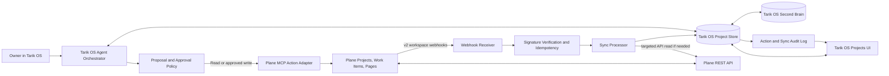
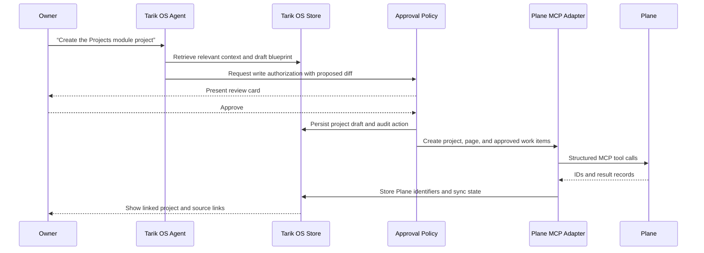
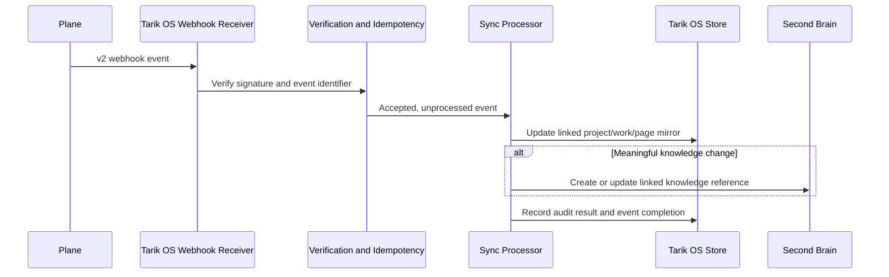

# Tarik OS × Plane: Projects, Wiki, and Second Brain Integration Design

> **Product statement.** Tarik OS should be the conversational command center where the owner thinks, decides, and asks for action. Plane should be the connected execution workspace for projects, work items, cycles, and shared project pages. The Tarik OS Second Brain should remain the semantic memory layer that links decisions, project context, research, and reflections without indiscriminately duplicating every external record.

**Status:** Architecture and product specification  
**Prepared for:** Tarik OS  
**Primary integration:** Plane MCP Server, Plane REST API, and Plane v2 webhooks  
**Scope:** Project creation and management, work items, Plane Pages/Wiki, Second Brain synchronization, agent permissions, and auditability

---

## 1. What This Enables

The proposed integration lets the Tarik OS agent turn natural-language project conversations into deliberate, reviewable execution records. For example, the owner could say:

> “Create a project for the Tarik OS Projects module. Make a project brief, turn the design spec into initial work items, and connect the technical notes to my Second Brain.”

Tarik OS would first assemble a **Project Blueprint** in its own interface: objective, definition of done, identity or strategic connection, work breakdown, proposed Plane project identifier, initial documentation, and linked Second Brain sources. After the owner approves the external write, Tarik OS creates the Plane project, creates the selected work items and project pages, stores the cross-system identifiers, and exposes ongoing status in the Tarik OS Projects section.

Plane’s MCP Server is suitable for agent-directed reads and approved writes because it exposes more than 100 tools across project, work-item, cycle, module, initiative, and page functionality.[1] Plane’s REST API and v2 webhooks are the appropriate synchronization layer: API calls mutate or retrieve records, while workspace-level webhooks provide event-driven updates and include identifiers for deduplication and attribute diffs.[2] [3]

---

## 2. Architecture Options

The decision is not simply “MCP or API.” The best fit depends on whether you need an assistant that can **act in the current conversation** only, or a durable product integration that remains current when Plane changes outside Tarik OS.

| Approach | What it provides | Tradeoffs | Ongoing cost | Setup complexity |
|---|---|---|---|---|
| **A. Conversational Plane bridge** | The Tarik OS agent reads and writes Plane through the MCP server during a live conversation. Tarik OS stores links and selected summaries. | Fastest way to prove the agent workflow, but no real-time inbound sync, robust audit queue, or reliable Second Brain mirror. External Plane changes appear only after a manual refresh. | Uses existing Tarik OS hosting and Plane account. | Low to medium. |
| **B. Connected Projects Service** | Tarik OS uses MCP for interactive agent actions and uses a backend integration service with Plane API + verified webhooks for two-way project, work-item, and page synchronization. | More implementation work, including a database, webhook endpoint, idempotency, conflict handling, and credential management. It creates the dependable product experience requested. | Uses existing app hosting; no per-run agent task is required for deterministic sync. | Medium to high. |
| **C. Connected Projects Service + Plane-native agent** | Adds a mentionable version of the Tarik OS agent inside Plane work-item comments, while retaining the Tarik OS UI as the primary command center. | Requires OAuth app registration, a bot token, additional webhook handling, and ongoing beta-feature validation. Plane documents its native agent framework as beta.[4] | Same hosting plus additional implementation and monitoring effort. | High. |

**Decision guidance.** Approach A is a useful pilot if you want to validate commands and approval language first. Approach B is the durable implementation for a living Projects section that stays synchronized with Plane and the Second Brain. Approach C should be an optional second phase—not a prerequisite—so Tarik OS can first establish dependable synchronization, approval controls, and audit trails.

---

## 3. Recommended Responsibility Model

Tarik OS and Plane should not compete to be the master of the same field. The system should use a **field-level source-of-truth model** instead of a vague “two-way sync.”

| Domain | System of record | What is synchronized | Rationale |
|---|---|---|---|
| Tarik OS strategic context | **Tarik OS** | Project intent, personal goals, private reflections, agent drafts, decision history, and Second Brain relationships. | This is the personal-agent layer and may contain private or cross-project context that should not be copied to Plane automatically. |
| Plane project execution | **Plane** after a project is linked | Project execution state, work items, assignments, priorities, labels, cycles, modules, and work-item activity. | Plane is designed for shared operational tracking and collaboration. |
| Shared project overview | **Controlled two-way** | Name, description, target dates, status, and key milestones. | These are useful in both places. Every update carries an origin and sync version to prevent echo loops. |
| Plane project Pages/Wiki | **Plane** for published execution documentation | A linked, searchable Second Brain reference plus an owner-approved extracted summary. | Keeps project docs current where the team works while preserving semantic discoverability in Tarik OS. |
| Second Brain notes and memories | **Tarik OS** | Explicit links to Plane projects/pages/work items; optional excerpts and tags. | Prevents accidental publication of personal memories, journal entries, or unrelated confidential context. |

### Non-negotiable principle

> **Do not automatically replicate every Plane comment, notification, or private Tarik OS memory.** Store durable project knowledge, decisions, summaries, and links—then retrieve the original source on demand.

---

## 4. Core System Architecture



The **MCP Action Adapter** serves the live agent conversation. It maps the agent’s structured intent to Plane MCP tools, such as `create_project`, `create_work_item`, `list_work_items`, `create_work_item_comment`, and Page tools.[1] The **Sync Processor** is deterministic backend code, not an agent session: it verifies Plane webhook signatures, deduplicates events, updates Tarik OS records, and creates Second Brain references according to the explicit rules below.

Plane v2 webhooks are workspace-level, so the Tarik OS receiver must filter and route events to the appropriate linked project internally. Plane documents v2 delivery identifiers and prior attributes that support deduplication and diff-aware processing.[2]

---

## 5. Agent Permission and Approval Policy

The agent should be useful by default without silently changing shared project records. Every action is assigned a permission class.

| Permission class | Agent behavior | Examples |
|---|---|---|
| **Read** | Execute immediately and cite the source record in Tarik OS. | Search linked project pages; summarize active work items; report blockers; find a decision in the project wiki. |
| **Propose** | Draft a structured change in Tarik OS but do not write externally. | A new project blueprint; a work-item breakdown; an updated wiki outline; priority or cycle recommendations. |
| **Write after approval** | Show a concise diff and wait for the owner’s approval before calling Plane. | Create a project; create or edit work items; create or edit Plane pages; add a comment; change state, due date, priority, or assignment. |
| **Elevated confirmation** | Require an explicit confirmation that names the affected records and action. | Delete/archive a project, work item, or page; bulk state changes; mass reassignment; external sharing/publication; changes to collaborators or permissions. |

### Approval card format

Before a write, Tarik OS displays a compact review card:

```markdown
## Ready to sync to Plane

**Project:** Tarik OS Projects (`TARIK`)
**Creates:** 1 project, 1 project page, 6 work items
**Updates:** 0 existing records
**Second Brain links:** 3 existing notes; no private journal entries will be copied

[Review details]  [Approve sync]  [Edit draft]  [Keep in Tarik OS only]
```

This is stricter than a simple “are you sure?” prompt because it reveals **where data is going, what will be created, and what will remain private**.

---

## 6. Conversational Workflows

### 6.1 Create a project from a conversation

1. The owner describes an initiative, problem, or project in Tarik OS.
2. The agent retrieves relevant Second Brain context and asks only for missing decisions: project name, desired outcome, collaborator visibility, target date, and whether the project should be shared with Plane.
3. The agent generates a Project Blueprint in Tarik OS.
4. The owner approves the proposed Plane writes.
5. Tarik OS creates the local project record, then creates the Plane project and its foundational execution records through the MCP adapter.
6. Tarik OS stores the Plane workspace slug, project UUID, and project identifier, then creates initial Second Brain relations.

### 6.2 Turn a decision into execution work

The owner can say, “Turn the decision to add the Projects module into actionable work.” The agent reads the linked decision, proposes a work breakdown, identifies dependencies, and asks for approval before creating Plane work items. It should never create a pile of low-quality tasks merely because a conversation contains an idea.

### 6.3 Create or update project documentation

The owner can say, “Write the architecture decision into the project wiki.” The agent prepares a page preview with title, project location, purpose, and source links. On approval it writes to a Plane Page and stores a linked Second Brain knowledge record with a concise summary, tags, Plane page ID, and canonical URL.

### 6.4 Bring Plane activity into the Second Brain

When a linked Plane project changes, Plane webhooks update the Tarik OS project mirror. Only notable activity becomes a Second Brain candidate—for example, a project brief page changed, a milestone completed, a decision-comment pinned, or a work item marked blocked. The agent may summarize candidates in the daily brief, but it does not copy routine status churn into long-term memory.

### 6.5 Ask from Plane (optional later phase)

If the Plane-native agent is enabled, the owner may mention it inside a Plane work-item thread. Plane sends an Agent Run webhook with the relevant work-item and discussion context; Tarik OS handles the request, applies the same permission policy, and posts the final response or an elicitation back to the thread.[4] This shares the same agent policy rather than creating a less controlled second agent.

---

## 7. Tarik OS Projects Section

The new left-rail module should be labeled **PROJECTS** and use a dedicated accent that does not conflict with the existing Telos cyan or Second Brain violet—muted acid green or a desaturated amber would fit the established operating-system palette.

### Main workspace

| Region | Content | Primary actions |
|---|---|---|
| **Project rail** | Linked Plane projects, local-only drafts, health status, last sync, and a compact count of active/blocked work. | Select project; create project; filter by active, paused, or archived. |
| **Execution center** | Project objective, current state, current cycle, milestones, prioritized work items, blockers, and activity. | Create task; update state; start focus session; ask the agent for a plan or status. |
| **Knowledge/context panel** | Linked Plane Pages, Second Brain sources, decisions, research, and open questions. | Add source; draft wiki page; search context; review whether a note is private or shared. |
| **Sync and audit strip** | Connection health, last Plane event, pending proposals, last successful sync, conflict queue, and link to Plane. | Review changes; retry failed sync; resolve conflict; open source in Plane. |

### Essential views

| View | Job to be done | Key components |
|---|---|---|
| **Overview** | Understand whether the project is moving. | Objective, health, milestones, next three actions, blockers, latest decision, sync status. |
| **Work** | Manage execution without leaving Tarik OS. | Plane-backed work-item table/board, quick state updates, priority, due date, assignee, and agent-generated draft tasks. |
| **Wiki** | Read and draft project documentation. | Plane Page list, selected page reader, draft diff, source links, and “send to Plane” approval action. |
| **Context** | Connect execution with thinking. | Second Brain notes, research, decisions, personal constraints, semantic search, and privacy labels. |
| **Activity** | Trust the synchronization. | Plane event stream, Tarik OS writes, webhook status, retries, and conflict-resolution history. |

The persistent Tarik OS agent composer should support project-scoped prompts automatically. When a project is selected, a conversation such as “What is blocked?” should include the selected project’s execution context and linked knowledge, not the entire workspace by default.

---

## 8. Data Model and Cross-System Identifiers

Tarik OS needs explicit mappings. Do not rely on project titles, page titles, or work-item names as sync keys.

| Tarik OS record | Required Plane mapping | Required sync fields |
|---|---|---|
| `project` | `plane_workspace_slug`, `plane_project_id`, `plane_project_identifier` | `sync_status`, `last_plane_event_at`, `last_synced_at`, `revision`, `origin` |
| `project_work_item` | `plane_work_item_id`, `plane_identifier` | `local_updated_at`, `plane_updated_at`, `last_write_origin`, `last_sync_hash` |
| `project_document` | `plane_page_id` and canonical Plane URL, when published | `visibility`, `publish_status`, `source_record_ids`, `content_hash` |
| `knowledge_record` | Optional related Plane project/page/work-item IDs | `privacy_class`, `summary`, `relation_type`, `retrieval_embedding_version` |
| `sync_event` | `plane_delivery_id`, `plane_event_id` | `event_type`, `received_at`, `processed_at`, `status`, `error`, `retry_count` |
| `agent_action` | Optional target Plane IDs | `permission_class`, `proposed_diff`, `approved_at`, `executed_at`, `result`, `actor` |

### Event processing rules

1. Verify the webhook signature **before** parsing or storing the payload.
2. Persist the event’s delivery/event identifier before performing side effects; reject a previously processed identifier.
3. Apply the update to the Tarik OS project mirror in a transaction.
4. Use `previous_attributes` to decide whether a meaningful field changed; do not create a Second Brain item for routine noise.
5. Record the event outcome and retry only transient failures.
6. When Tarik OS performs a Plane write, save an origin marker and expected hash/version. A returning webhook should update the mirror but must not cause a reciprocal write back to Plane.
7. When concurrent edits conflict on a shared field, preserve both versions in a conflict record and ask the owner which version wins. Do not silently apply last-write-wins to a strategic brief or wiki page.

---

## 9. Second Brain Synchronization Rules

The Second Brain should contain **meaningful, retrievable context**, not an uncontrolled shadow copy of Plane.

| Plane event or object | Second Brain action | Default privacy behavior |
|---|---|---|
| Linked project created | Create a project hub relation with objective, Plane link, tags, and origin. | Visible in Tarik OS only unless the user elects to publish additional content. |
| Plane project Page created/updated | Create or update a linked knowledge reference; index a short summary and canonical URL. | Do not copy private Tarik notes into Plane; retain source boundary. |
| Decision, milestone, or substantive project update | Create a curated project-memory candidate for owner review or automatic capture under an approved rule. | Include only the decision summary and source link by default. |
| Routine work-item state change | Update the local project mirror only. | No long-term memory item. |
| Work item marked blocked | Add a time-bound blocker signal to the project context and daily brief. | Remove/resolve when the source state changes. |
| Tarik OS research or design note | Keep private in Second Brain; present a proposed Plane Page only when the owner asks or a sharing rule allows it. | Never auto-publish. |

Every linked knowledge record should include an **origin badge**: `Tarik OS`, `Plane`, or `Derived by Agent`. This lets the owner understand whether a record is an original private note, an external project source, or a generated summary.

---

## 10. Synchronization Sequence

### Tarik OS → Plane



### Plane → Tarik OS



---

## 11. Security, Reliability, and Privacy Requirements

| Area | Requirement |
|---|---|
| **Credentials** | Store Plane personal access tokens, OAuth tokens, and webhook secrets server-side only. Never expose them to the browser or include them in generated Second Brain records. |
| **Authentication** | For a personal, single-workspace integration, a narrowly scoped Plane API token can be sufficient. If Tarik OS will be installed for multiple users/workspaces, use OAuth. Plane documents API-key and OAuth authentication separately.[3] |
| **Webhook validation** | Verify Plane’s signing secret for every inbound request. Reject invalid requests before business processing. |
| **Idempotency** | Persist and deduplicate Plane v2 `delivery_id` / `event_id`. The sync processor must tolerate retries and out-of-order delivery. |
| **Write control** | Route every mutation through the permission and approval policy. In particular, require elevated confirmation for destructive actions and collaborator-impacting changes. |
| **Auditability** | Store proposal text, approval, target records, request correlation ID, response status, and any changed fields. Show this history in Tarik OS. |
| **Knowledge privacy** | Keep personal notes, journals, and health/relationship information private unless the owner explicitly selects content for publishing to a Plane Page. |
| **Rate/error handling** | Queue transient webhook/API failures, retry with bounded exponential backoff, surface failures in the Projects sync strip, and never drop events silently. |

---

## 12. Build Phases

| Phase | Deliverable | Completion criteria |
|---|---|---|
| **0. Connection design** | Confirm Plane Cloud vs. self-hosted instance, workspace, auth approach, and required write permissions. | Credentials and endpoint strategy are selected; no secrets committed to code. |
| **1. Read-only foundation** | Tarik OS project list, work-item reader, Page reader, linked Second Brain references, and manual refresh. | The agent can answer project questions with traceable Plane sources, but cannot mutate Plane. |
| **2. Proposal workflow** | Project Blueprint, work-item and Page draft previews, approval cards, and action audit log. | The agent produces high-quality project proposals and the owner can approve/reject/edit them. |
| **3. Approved writes** | MCP/API adapter for project, work-item, comment, and Page creation/updates. | Approved changes reliably create/update the intended Plane records and local mappings. |
| **4. Event-driven sync** | Verified Plane v2 webhook endpoint, idempotent sync pipeline, conflict queue, and sync monitoring UI. | External Plane edits appear in Tarik OS without manual refresh and do not create echo loops. |
| **5. Optional Plane-native agent** | Mentionable Tarik OS agent in Plane comments using Agent Runs. | A Plane mention routes to the same orchestration/policy layer and returns a safe, auditable response. |

---

## 13. Open Decisions Before Implementation

1. **Plane deployment:** Are you using Plane Cloud or a self-hosted Plane instance? The base URL and MCP transport choice differ.[3]
2. **Scope:** Is this a personal, single-workspace Tarik OS integration or a future multi-user product? This determines whether a single personal token is appropriate for a pilot or OAuth is required from the start.
3. **Second Brain storage:** What currently backs the Tarik OS Second Brain—your own database/vector store, local files, or another service? This determines the sync schema and retrieval path.
4. **Write default:** Should the agent be read/propose-only initially, or should it be allowed to create low-risk work items after a one-time project-level authorization? The recommended launch default is **read + propose**, with every external write approved.
5. **Plane-native agent:** Do you want the user to be able to `@mention` the agent inside Plane in the first release, or should this be deferred until the Tarik OS-centered workflow and synchronization are stable?

---

## References

[1]: https://developers.plane.so/dev-tools/mcp-server-tools "Plane MCP Server Tool Reference"
[2]: https://developers.plane.so/dev-tools/intro-webhooks "Plane Webhooks"
[3]: https://developers.plane.so/api-reference/introduction "Plane API Documentation"
[4]: https://developers.plane.so/dev-tools/agents/overview "Plane Agents Overview"
[5]: https://developers.plane.so/dev-tools/agents/building-an-agent "Building an Agent — Plane"

---

**Recommended next move:** Choose an integration option from Section 2 and answer the open decisions in Section 13. Once the Tarik OS project source is available, the connection can be implemented in phased releases rather than attempting a high-risk, full-autonomy sync on day one.
