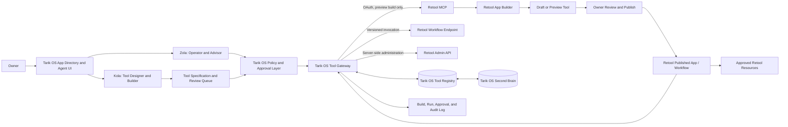
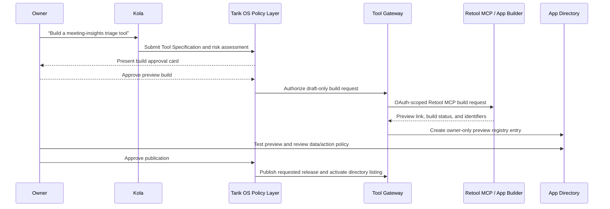

# Tarik OS × Retool: Governed Tool Factory, Workflows, and App Directory

> **Product statement.** Tarik OS is the command center where the owner asks Zola and Kola for help, reviews proposed capabilities, and launches approved tools. Retool is the connected builder and runtime for bounded operational apps and deterministic workflows. The Tarik OS App Directory is the visible registry and policy layer; it is not simply a list of every Retool app.

**Status:** Architecture and product specification  
**Primary use case:** Let Zola and Kola design, create, run, and surface approved Retool tools and workflows in Tarik OS  
**Integration surfaces:** Retool MCP, Retool Apps, Workflows, Agents, administrative API, and embedded-app SDKs  
**Default safety posture:** Draft and preview only; explicit owner approval is required for publication, data-resource expansion, scheduled automation, and high-impact actions

---

## 1. What This Enables

The desired experience is plausible and useful. An owner could tell Kola:

> “Create a customer-feedback triage tool. It should let me review Granola meeting insights, link them to a Plane project, and propose product opportunities.”

Kola should not immediately publish an app or connect all data sources. Instead, it creates a **Tool Specification** in Tarik OS: audience, user job, data sources, allowed actions, sensitivity, required approval points, and success criteria. After the owner approves the build request, Kola uses a governed Retool build path to produce a draft/preview. The owner then tests the tool, reviews resource access and data-handling policy, and explicitly publishes it. Tarik OS adds the published tool to the App Directory, where it can be launched by the owner or invoked by Zola through a narrow, documented capability.

Retool’s MCP server can build newer Retool apps from an external coding environment, import React apps, and manage certain organization/user functions through OAuth 2.0.[1] Retool documents the current MCP app-building flow as cloud-available, beta, and restricted to users with builder permission plus the `mcp:write` scope; the result is a preview, while publication happens through Retool’s app builder.[2] That boundary is desirable: Kola can help **build and iterate**, but it should not automatically publish a tool.

---

## 2. Integration Options

The integration should match the maturity of Tarik OS and the desired level of operational autonomy.

| Approach | What it provides | Tradeoffs | Cost | Setup complexity |
|---|---|---|---|---|
| **A. Curated launch directory** | Tarik OS maintains a branded directory of selected Retool apps. Zola can link the owner to a tool, but cannot invoke workflows or build apps. | Quick and low risk, but it does not give Kola a full tool-factory loop or let Zola perform structured operational actions. | Uses existing Retool/Tarik OS plans. | Low. |
| **B. Governed tool factory** | Kola creates tool specifications and Retool draft previews through MCP; Tarik OS governs review, publication, app-directory listing, and server-side workflow invocation. | Requires a Tool Gateway, audit records, policy model, Retool OAuth/token setup, and durable metadata. This is the fullest match for the requested product. | Uses existing application hosting and the relevant Retool plan/features. | Medium to high. |
| **C. Autonomous tool builder and operator** | Kola can create tools, enable resources, publish apps, configure schedules, and invoke actions with minimal review. | Fast but unsafe: it can expose data, create unmaintained tools, and execute unexpected workflow actions. This model is unsuitable as an initial release. | Potentially higher usage, support, and incident cost. | High. |

The choice belongs to the owner. Approach A is appropriate for a fast directory prototype, while Approach B is appropriate when Tarik OS needs a dependable tool lifecycle. Approach C should be considered only after the review, audit, and access-control mechanisms in this design have shown sustained reliability.

---

## 3. Clear Separation of Responsibilities

The integration succeeds when Tarik OS and Retool have separate, compatible roles.

| Concern | Tarik OS responsibility | Retool responsibility |
|---|---|---|
| **Conversation and personal context** | Zola/Kola chat, Telos, Second Brain relationships, user intent, approval cards, and privacy policy. | None; receive only minimum approved task context. |
| **Tool design** | Tool Specification, data-sensitivity review, intended audience, operational constraints, and acceptance criteria. | Build a preview app or workflow according to the approved specification. |
| **Tool runtime UI** | App Directory, launch shell, contextual navigation, policy/status badges, and cross-tool provenance. | Rich operational app screens, queries, forms, and workspace-based functionality. |
| **Deterministic automation** | Authorize and invoke a named, versioned capability through the Tool Gateway; retain business-level audit history. | Execute the specific workflow, interact with connected resources, and return typed results. |
| **Agents** | Zola is the personal agent; Kola is the tool-design/build agent. | Optional specialized agent/workflow support only when a narrow use case benefits from it. |
| **Identity and memory** | Own user identity, Second Brain, personal preferences, private context, and project relationships. | Own Retool object permissions, resource credentials, app builds, workflow logs, and app-level roles. |

> **Rule:** Retool must not become Zola’s private memory store, and Tarik OS must not bypass Retool’s resource permissions. Every cross-system action should carry a declared purpose, caller, tool identifier, version, and audit correlation ID.

---

## 4. Recommended System Architecture



The **Tarik OS Tool Gateway** is the mandatory server-side boundary. It does four things:

1. Validates that a user or agent may request a specific capability.
2. Applies the Tarik OS approval policy and converts conversational intent into a limited, typed input.
3. Calls a known Retool MCP, workflow, or administrative endpoint with server-held credentials.
4. Normalizes the result, records the audit event, and returns a safe, source-aware response to Tarik OS.

No Tarik OS browser component, agent prompt, embedded Retool app, or tool card receives a reusable Retool administrative token or workflow API key. Retool’s administrative API uses organization access tokens with Bearer authentication, which must remain server-side and scoped to the minimum necessary permissions.[3]

---

## 5. The Tool Lifecycle

A tool must be a governed product object rather than a one-off agent artifact.

| Lifecycle state | Kola / Zola permissions | Owner action | Retool state | Directory behavior |
|---|---|---|---|---|
| **Idea** | Kola can clarify the goal and draft a Tool Specification. | None required to brainstorm. | No Retool object yet. | Not visible. |
| **Proposed** | Kola can produce functional, data, and risk requirements. | Approve design or request changes. | No build yet. | Visible only in owner’s review queue. |
| **Build approved** | Kola can request a Retool MCP draft build with an approved specification. | Approve draft build request. | Build starts; preview is generated. | Shows build status only. |
| **Preview** | Kola can iterate within the approved tool boundary. Zola may not invoke it for live actions. | Test usability, inspect resources, and approve or reject. | Draft/preview only. | Owner-only preview tile. |
| **Security reviewed** | Kola cannot add new data resources without a new review. | Confirm sources, action classes, retention, and roles. | Release candidate. | Shows pending-release status. |
| **Published** | Zola can invoke only declared capabilities. Kola can propose changes. | Publish and activate directory record. | Published app/workflow release. | Available to authorized users. |
| **Suspended / retired** | Invocation blocked. | Reactivate, archive, or delete with elevated confirmation. | Disabled/unpublished as appropriate. | Not launchable; history retained. |

### Tool Specification template

```markdown
# Tool Specification: Customer Feedback Triage

**Owner:** Tarik
**Purpose:** Review recurring feedback from authorized meeting summaries and turn selected insights into project proposals.
**Users:** Tarik only in v1.
**Inputs:** Granola meeting-summary references; selected Plane project metadata.
**Outputs:** Feedback clusters, source ledger, proposed Plane work-item draft.
**Allowed actions:** Read Granola/Plane through approved adapters; propose a Plane item.
**Blocked actions:** Direct task creation, publishing, bulk export, external sharing, and background schedules.
**Data classification:** Meeting summaries and project metadata; no raw transcript caching.
**Approval points:** Retool draft build, publication, resource additions, each Plane write.
**Success criteria:** Every cluster has sources; no external write occurs without approval.
```

This specification is the artifact Kola uses to build. It also becomes the directory card’s operational contract, so Zola knows what a published tool can and cannot do.

---

## 6. Kola Build Workflow

Kola can help build Retool tools, but its role must be constrained to **design, draft creation, and test iteration**. It should never treat a natural-language request as authority to connect a sensitive source or publish an app.



Retool’s app-building MCP flow returns a preview and leaves publication/management in the app builder. It requires a builder user and explicit `mcp:write` authorization, and the documented MCP app-building capability is beta.[2] Tarik OS should preserve that separation by making **Preview** and **Published** different lifecycle states, not a single button.

### Build constraints

| Area | Kola default | Requires new approval |
|---|---|---|
| App layout and copy | May draft and revise within the approved specification. | Material change to purpose or audience. |
| Retool data resource | May reference an already approved resource by ID. | Any new resource, credential, scope, write permission, or cross-workspace connection. |
| Workflow | May create a draft with typed input/output schema. | Schedule, webhook trigger, external side effect, retry policy, or new destination. |
| Code/function | May draft a non-destructive function. | Network egress, file write, secrets access, data export, or mutation of a system of record. |
| Publication | Cannot publish. | Explicit owner approval after review. |
| App-directory listing | Cannot self-list a tool. | Explicit owner approval and registry review. |

---

## 7. Zola Operating Tools and Workflow Invocation

Published Retool work should become **narrow capabilities**, not a giant tool available for arbitrary prompting. Zola receives the tool contract from the Tarik OS registry.

| Zola tool | Purpose | Input boundary | Invocation policy |
|---|---|---|---|
| `directory_search` | Discover published tools the owner is allowed to use. | Query, category, context tag. | Read immediately. |
| `tool_get_contract` | Retrieve owner, purpose, data classifications, allowed actions, version, and approval policy. | Tool ID. | Read immediately. |
| `tool_run_preview` | Test a preview tool with non-production data. | Tool ID and test fixture. | Owner-only; no production resource access. |
| `workflow_invoke` | Run a named published Retool workflow with a validated input object. | Tool ID, workflow alias/version, typed input. | Read-only flows can run after policy check; mutations require approval card. |
| `tool_open` | Open a published Retool app in an embedded panel or new tab. | Tool ID and contextual data. | Launch only after identity/role check. |
| `tool_propose_change` | Create a change request for Kola. | Tool ID, requested change, reason. | Creates a Tarik OS proposal; no Retool change. |
| `tool_suspend` | Suspend launch/invocation of a tool. | Tool ID and reason. | Elevated confirmation required; immediately blocks the gateway. |

### Workflow invocation rule

Retool Workflows can run in response to webhooks and can return a structured response using a Response block. Retool supports a per-workflow API key in the `X-Workflow-Api-Key` header and recommends the header rather than a URL query parameter because query strings may be logged.[4] The Tarik OS Tool Gateway must call these endpoints from the server, pass only the minimum typed JSON payload, and record the result. It must not disclose workflow URLs/keys to the browser or to Zola’s general context.

---

## 8. Retool Agents: Optional, Specialized Helpers

Retool Agents should not replace Zola or Kola. They may be useful as **specialized operational sub-agents** inside a narrow Retool domain—for example, classifying a queue, drafting a response, or preparing a validation report.

Retool Agents can use tools such as workflows, functions, other agents, or connected MCP resources, and they can be invoked from chat, email, applications, agent-to-agent flows, or workflows.[5] They run only when invoked; automatic execution is accomplished by a workflow trigger that invokes an agent.[5]

| Need | Preferred agent | Reason |
|---|---|---|
| Personal strategy, goals, projects, and Second Brain reasoning | **Zola** | Tarik OS owns the personal context, relationship and project boundaries, and cross-system policy. |
| Tool requirements, UI construction, draft build iterations, and release planning | **Kola** | Kola is the owner-facing builder and maintains the Tool Specification. |
| Structured, data-specific internal operation contained in Retool | **Retool Agent** (optional) | Retool can grant the agent only the resources and tools approved for that operational domain. |
| Recurring deterministic data movement or action | **Retool Workflow** | A bounded workflow is more predictable and auditable than an autonomous LLM loop. |

### Retool permission implications

Retool permissioning applies to both the agent and its underlying resources. Agents and resources have `Use`, `Edit`, and `Own` levels; a user also needs resource access for an agent tool call to succeed.[6] Retool supports per-tool user confirmation in its chat/app experience, but tools requiring consent cannot run through a workflow or agent-to-agent invocation.[6]

Therefore, any unattended or event-triggered Retool automation must use only **deterministic, low-impact, pre-approved tools**. A high-impact action must return to Tarik OS for approval rather than trying to bypass consent through an automated invocation path.

---

## 9. Tool Governance and Data Access Model

Every directory item needs an enforceable registry record. This is how Tarik OS keeps a clean distinction between a capable Retool app and a safe, available agent tool.

| Registry field | Purpose |
|---|---|
| `tool_id` and `slug` | Stable Tarik OS identifier; never use title as a key. |
| `retool_object_type` / `retool_object_id` | References the Retool app, workflow, or agent. |
| `version` / `release_id` | Pins a compatible published release or workflow revision. |
| `owner` / `maintainer` | Person accountable for tool behavior and retirement. |
| `lifecycle_state` | Idea, Proposed, Preview, Security Reviewed, Published, Suspended, or Retired. |
| `intent_contract` | The user job, inputs, outputs, limitations, and success criteria. |
| `data_classes` | Examples: public data, project metadata, customer data, meeting summary, personal/private. |
| `approved_resources` | Only the Retool resource IDs and permitted operations reviewed for this tool. |
| `action_class` | Read, Propose, Write After Approval, or Elevated Confirmation. |
| `human_approval_policy` | When to show a Tarik OS approval card and whether Retool-level consent is also required. |
| `exposure_mode` | Directory tile, embedded panel, new-tab app, Zola tool, Kola builder component, or event-only workflow. |
| `audit_policy` | Required fields, retention period, and sensitive-value redaction rules. |
| `kill_switch` | Gateway switch that immediately disables invocation and launch. |

### Action classes

| Action class | Examples | Default behavior |
|---|---|---|
| **Read** | Retrieve a Plane project, search approved Granola summaries, render a dashboard. | Execute after identity and scope check. |
| **Propose** | Draft a report, project task, email, or workflow change. | Show draft; no system-of-record write. |
| **Write After Approval** | Create a Plane work item, update a wiki page, submit a CRM record, or publish a report. | Present concise diff and wait for approval. |
| **Elevated Confirmation** | Delete data, bulk modify records, export sensitive data, modify permissions, add credentials, publish a new tool, or enable a schedule/webhook. | Require explicit confirmation that names the exact impact. |

---

## 10. Tarik OS App Directory Experience

The directory should look and behave like a native Tarik OS module, not a secondary vendor dashboard. It is the owner’s catalog of trusted capabilities.

### Information architecture

| Directory region | Content | Main interactions |
|---|---|---|
| **Left rail module** | Add a `TOOLS` or `OPS` item with a distinct muted accent, preserving the established dark command-center layout. | Open directory; show pending approvals count. |
| **Directory grid** | Published tools, previews, recently used items, project-linked tools, and suggested capabilities. | Search, filter, launch, inspect contract, request a change. |
| **Tool detail panel** | Purpose, owner, status, data sources, permissions, version, last run, source systems, and activity. | Launch, run approved workflow, open review/audit history, suspend. |
| **Builder queue** | Tool ideas and Kola’s proposals organized by lifecycle state. | Review specification, approve preview build, view preview, approve publication. |
| **Automation ledger** | Scheduled/event-driven Retool workflows, webhook health, recent runs, errors, last configuration change. | Pause, retry, review payload schema, rotate/replace credentials through controlled admin flow. |

### Directory card anatomy

```markdown
[TOOL] Customer Feedback Triage                 [PUBLISHED]

Find recurring customer feedback across selected meeting summaries
and create a cited project-work proposal.

Sources: Granola summaries · Plane projects
Actions: Read · Propose
Privacy: Meeting summaries only
Last run: 18 min ago      Owner: Tarik      Version: 1.2

[Open tool] [Ask Zola] [View contract] [Activity]
```

A card should make scope legible before launch. The owner should never discover after the fact that a tool reads private notes, has a wide workspace token, or can write to an external system.

---

## 11. Embedding and Launch Strategy

Retool supports embedding classic apps in an existing web application with React or JavaScript SDKs, including structured parent/child data exchange.[7] The choice of embedded panel versus new-tab launch should be made per tool, not globally.

| Launch style | Good for | Cautions |
|---|---|---|
| **Tarik OS embedded panel** | Short, contextual tasks such as reviewing an approved triage queue or editing project metadata while a project is selected. | Requires careful identity integration. Retool recommends same top-level domain, HTTPS, and shared SSO or server-side custom authentication for seamless embedded access.[7] |
| **New tab / dedicated Retool page** | Complex operational tools, wide tables, multi-step forms, and deep review work. | Context handoff needs an explicit project/tool identifier; return-to-Tarik-OS action should preserve audit context. |
| **Zola capability only** | Headless lookup or narrow workflow actions with no human form needed. | Must use a typed gateway contract, never raw access to a generic Retool resource. |
| **Event-only workflow** | Inbound webhook handling, scheduled ETL, data synchronization, and low-impact notifications. | No direct user interface. Must include secret management, idempotency, monitoring, and a kill switch. |

Custom authentication for embedded apps is documented for Business and Enterprise plans; shared SSO may reduce double-authentication when both systems use the same identity provider.[7] For a personal Tarik OS instance, launching a tool in a new tab first is often the simplest proof of value; an embedded experience is appropriate after identity and domain configuration are settled.

---

## 12. Security, Reliability, and Audit Requirements

| Area | Requirement |
|---|---|
| **Credential boundary** | Keep Retool OAuth credentials, API tokens, and workflow API keys only in server-side secret storage. Never serialize them into app-directory records, user-visible logs, or LLM context. |
| **Least privilege** | Register the smallest possible set of Retool resources, scopes, and role grants for each tool. A tool should use named resource IDs, not generic organization-wide access. |
| **Build authority** | Require a Retool builder with OAuth authorization for MCP build operations. Kola creates draft previews only; publication is a separate owner approval. |
| **Workflow validation** | Enforce a strict schema for each gateway input and output. Reject extra fields, unexpected destination IDs, and actions that violate the published tool contract. |
| **Webhook safety** | Verify inbound signatures from external sources before forwarding to Retool. Invoke an exact workflow through a server-held header, not a browser-visible key. |
| **Approval defense in depth** | Use Tarik OS approval cards for cross-system consequences. Where Retool Agent chat/app is directly exposed, enable Retool tool confirmation for high-impact calls.[6] |
| **Audit trail** | Record `tool_id`, release/version, actor, origin agent, requested intent, approved diff, resource category, correlation ID, input/output hashes, timestamp, and status. Redact secret/sensitive values. |
| **Idempotency and retries** | Retool workflows must accept an idempotency key where a duplicate write could be harmful. The gateway records the first execution before retrying any transient failure. |
| **Kill switch** | A Tarik OS tool suspension must immediately block new gateway invocations. Retool publishing/automation disabling is a second control, not the first. |
| **Change management** | Resource additions, action-class increases, trigger changes, schedule activation, data exports, and publication require a new security review rather than a silent in-place update. |

---

## 13. Build Phases

| Phase | Deliverable | Completion criteria |
|---|---|---|
| **0. Foundation decision** | Choose Retool Cloud or self-hosted, identity model, organization roles, and first tool category. | One named owner and builder, no credentials in client code, and an approved tool-governance policy. |
| **1. App Directory prototype** | Native Tarik OS directory with manually registered Retool links, tool cards, contract display, and tool lifecycle states. | The owner can discover and launch selected tools with no direct agent mutation. |
| **2. Tool Specification + Kola queue** | Kola creates structured tool proposals; owner can approve/reject/build preview. | Every proposed tool has purpose, data classes, source permissions, and action classes. |
| **3. Retool MCP preview builds** | Server-side build broker with OAuth-scoped Retool MCP connection and preview tracking. | Kola can produce Retool previews, but cannot publish or add resources without approval. |
| **4. Tool Gateway + workflow actions** | Named workflow registry, typed input/output schemas, server-side invocation, approval cards, and audit log. | Zola can invoke low-risk capabilities and propose protected writes safely. |
| **5. Embedded tools and automation ledger** | Optional embed/SSO integration, webhook/schedule registry, monitoring, run history, and kill switch. | Published tools fit naturally inside Tarik OS and every automation is controlled and observable. |
| **6. Optional Retool sub-agents** | Narrow Retool Agents for selected domains, with evals and explicit resource/consent settings. | No autonomous agent has more access than its tool contract and resources permit. |

---

## 14. Open Decisions Before Implementation

1. **Deployment:** Are you using Retool Cloud or self-hosted Retool? The MCP build flow is documented as cloud-available and self-hosted support depends on supported versions.[1] [2]
2. **Identity:** Is Tarik OS single-user today, or will it support collaborators? This determines whether launch in a new tab is sufficient initially or if SSO/embedded custom authentication is needed.
3. **Build authority:** Who will be the authorized Retool builder that approves Kola’s MCP build request and `mcp:write` scopes? Kola should never be the autonomous identity holder.
4. **First tool:** Which one small, high-value tool should establish the pattern—meeting-insight triage, Plane project briefing, a personal finance dashboard, or another workflow?
5. **Workflow policy:** Which types of side effects, if any, should Zola be allowed to invoke automatically? The default should be read-only execution and proposed writes.
6. **Data policy:** May published tools access private Granola notes, only approved meeting summaries, or only non-sensitive project data in the first release?

---

## References

[1]: https://docs.retool.com/build/apps/guides/mcp "Use MCP to build apps — Retool"
[2]: https://docs.retool.com/changelog/mcp-app-building "Build apps via MCP — Retool"
[3]: https://docs.retool.com/org-users/guides/retool-api/authentication "Configure Retool API authentication"
[4]: https://docs.retool.com/workflows/guides/webhooks "Trigger workflows with webhooks — Retool"
[5]: https://docs.retool.com/agents/concepts/overview "Retool Agents overview"
[6]: https://docs.retool.com/permissions/guides/agent-permissions "Manage permissions for Retool Agents"
[7]: https://docs.retool.com/apps/guides/app-management/embed-apps "Embed classic apps — Retool"

---

**Next step:** Select an integration approach from Section 2 and answer the six open decisions. With that, the first directory prototype and one governed Retool tool can be implemented without creating an uncontrolled agent-to-production pipeline.
